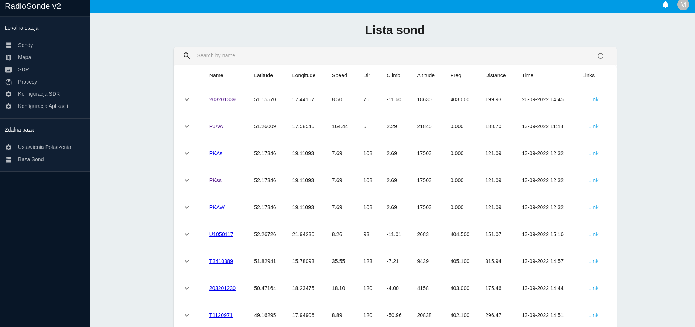
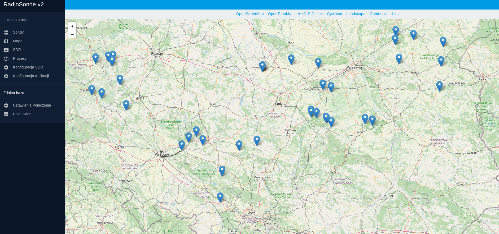
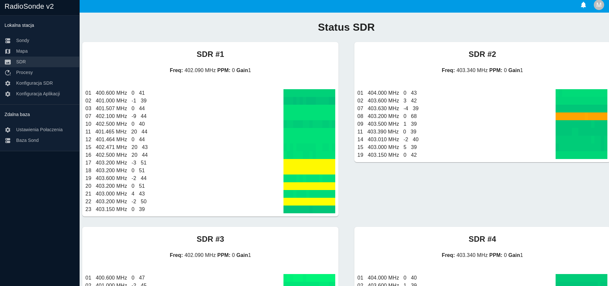
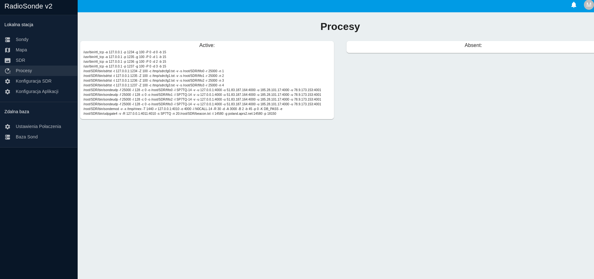
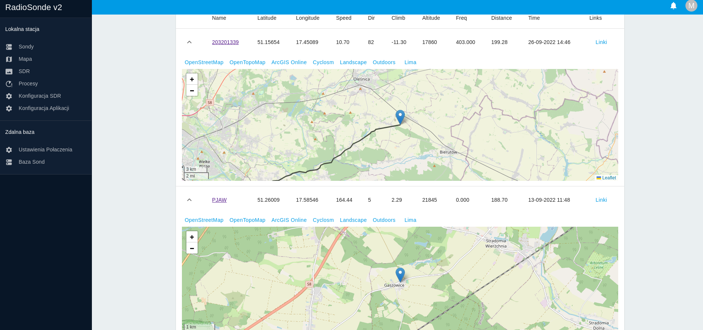
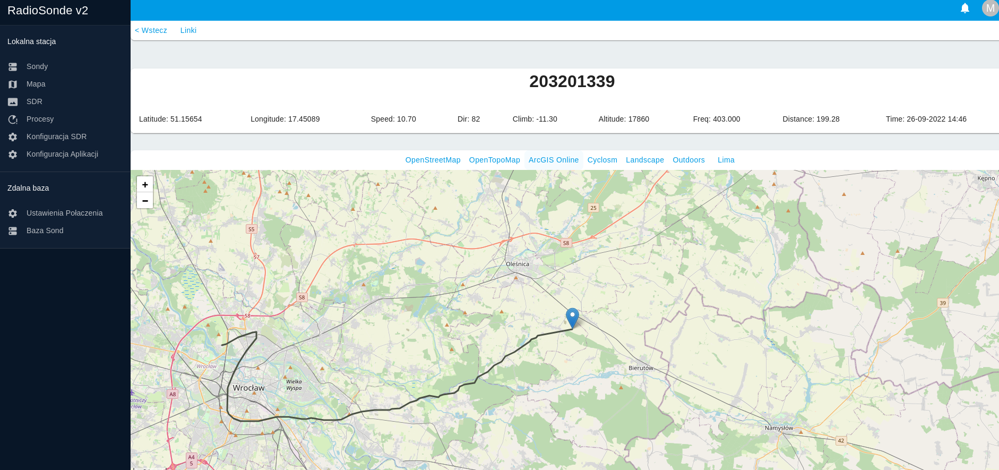
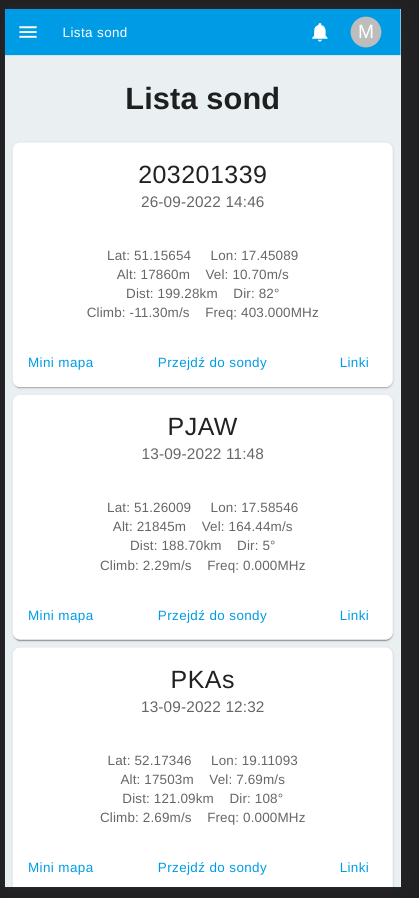
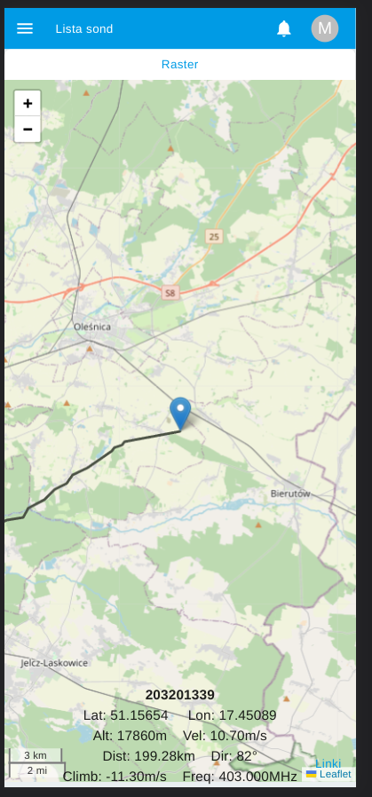
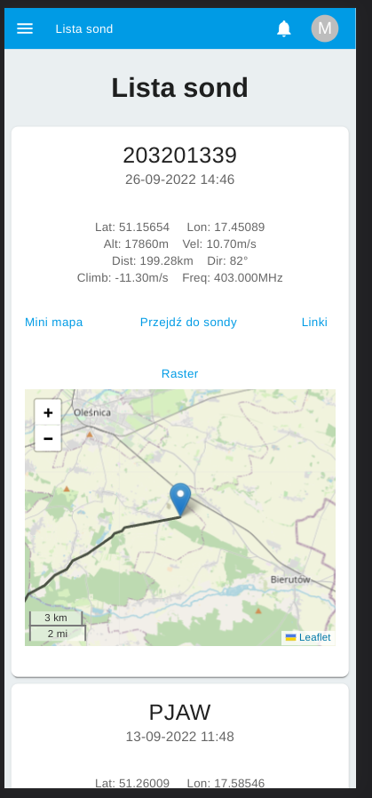

<p align="center">
  
</p>


  <p align="center">New Sonde Panel for <a href="https://github.com/sp9skp/spdxl">sp9skp/spdxl</a> app.</p>
    <p align="center">
</p>

App is on [MIT licensed](LICENSE).


## Before install

Install node.js v16

```
https://nodejs.org/en/download/package-manager/#debian-and-ubuntu-based-linux-distributions
```

then install pm2
```
npm install pm2 -g
```


## Installation

```bash
git clone https://github.com/sptq/sonde_panel
cd sonde_panel
npm install
npm run build 
cd web
npm install
npm run build
```

## Configuration
Edit file: ecosystem.config.js

```
module.exports = {
  apps : [{
    script: 'dist/main.js',
    watch: false,
    env: {
      "NODE_ENV": "production",
      "LAN": "51.3678", //set your lan
      "LON": "20.2951", //set your lon
      "NUMBERS_OF_SDRS": 4, //set number of sdrs
    }
  }]
};
```

## Start app

```bash
pm2 start ecosystem.config.js
```

App will be available on port 3000

## Demo Desktop







## Demo Mobile



